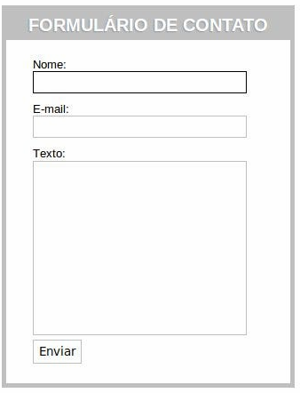

# Relatório de Bugs - Formulário de Contato

> ***Nota**: Este relatório de bugs documenta um problema encontrado durante testes manuais do formulário de contato do Example Cafe, destacando minha capacidade de identificar e comunicar problemas de interface, apoiada pelo meu conhecimento em front-end.*

## Bug 1: Ausência de Mensagem de Erro para Campo Nome Vazio

- **Caso de Teste**: CT_Contato_002
- **Descrição**: O formulário de contato permite o envio quando o campo Nome está vazio, sem exibir uma mensagem de erro, o que viola o requisito de que todos os campos são obrigatórios.
- **Passos para Reproduzir**:
  1. Acesse a página do formulário de contato (www.examplecafe.com/contact).
  1. Deixe o campo Nome vazio.
  1. Insira um e-mail válido (ex.: "ana.silva@email.com") no campo E-mail.
  1. Insira uma mensagem válida (ex.: "Por favor, entre em contato sobre catering.") no campo Mensagem.
  1. Clique no botão Enviar.
- **Resultado Obtido**: O formulário é enviado com sucesso, e uma mensagem de sucesso aparece: “Obrigado pela sua mensagem! Entraremos em contato em breve.”
- **Resultado Esperado**: Uma mensagem de erro deveria aparecer abaixo do campo Nome: “O campo Nome é obrigatório,” e o formulário não deveria ser enviado.
- **Severidade**: Média (os usuários podem contornar a validação, mas o problema não causa perda de dados ou falha do sistema).
- **Ambiente**:
  - Navegador: Chrome (Versão 126.0.6478.127)
  - Dispositivo: Desktop (Windows 11, resolução 1920x1080)
  - URL: www.examplecafe.com/contact

- **Captura de Tela**:

> *"**Legenda**: A captura de tela mostra o formulário enviado com o campo Nome vazio, sem exibir mensagem de erro, evidenciando o problema de validação."*

- **Notas Adicionais**:
  - Testado no Firefox (Versão 128.0) com o mesmo resultado, indicando um problema em múltiplos  navegadores.
  - Usando as Ferramentas de Desenvolvedor do navegador, observei que não há validação JavaScript  acionada para o campo Nome, sugerindo um erro de implementação no front-end.
  - Esse bug impacta a experiência do usuário ao permitir envios incompletos, o que pode levar a dados inválidos no backend.

