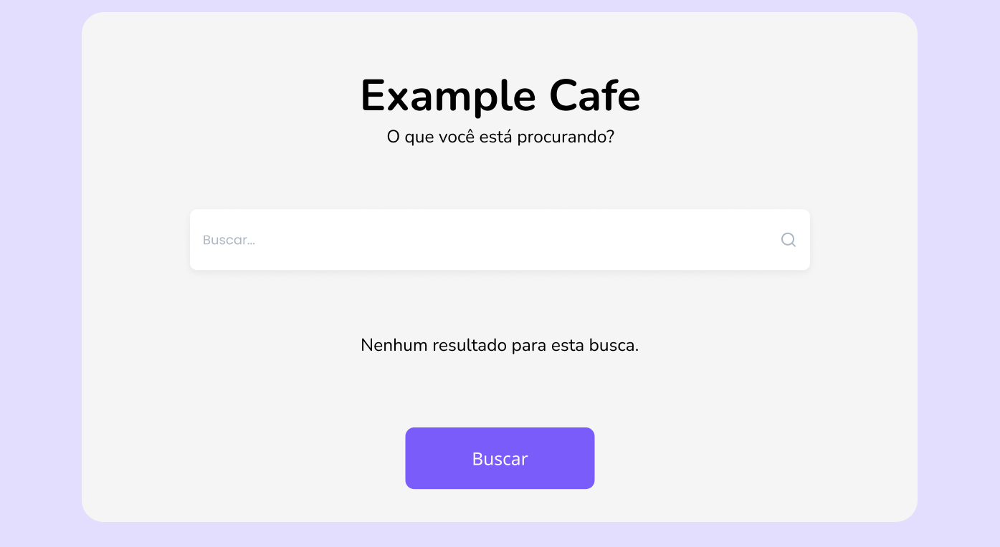

# Relatórios de Bug para Barra de Busca - Example Cafe

## Bug 1: Ausência de Mensagem de Erro para Busca Vazia

- **Caso de Teste**: CT_Busca_002
- **Descrição**: A barra de busca permite uma busca vazia sem exibir mensagem de erro.
- **Passos para Reproduzir**:
  1. Acesse <www.examplecafe.com>.
  2. Deixe o campo de busca vazio.
  3. Clique no botão de busca.
- **Resultado Obtido**: A página recarrega sem resultados ou mensagem.
- **Resultado Esperado**: Mensagem: “Por favor, insira um termo de busca.”
- **Severidade**: Média
- **Ambiente**: Chrome (Versão 126.0), Windows 11
- **Captura de Tela**: 
